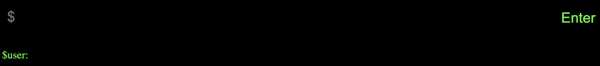

## webterm

A terminal clone built with TypeScript + React. Only small number of commands will be implemented.

### Features

- Luhn algorithm checker
  - debug version availble at `/ldebug`
- easter egg with `sudo` and `hacker` commands

### Limitations

- can only parse 1 command + 1 argument aka piping not supported
- UI, design is not my forte ¯\\_(ツ)_/¯

### Inspirations

- Linux terminal
- terminal portfolios